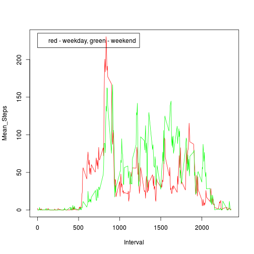

# Reproducible Research: Peer Assessment 1

## Loading and preprocessing the data

Extract the original activity.zip file, to get activity.csv

```r
unzip("activity.zip")
```

Load the data

```r
data <- read.csv("activity.csv", na.string="NA", colClasses=c("integer", "Date", "integer"))
```

Process/transform the data

```r
data$date <- as.Date(data$date, format = "%Y-%m-%d")
data$interval <- formatC(data$interval, width = 4, format = "d", flag = "0")
datetime <- strptime(paste(data$date,data$interval), "%F %H%M")
data <- cbind(data,datetime)
```


## What is mean total number of steps taken per day?

Histogram of the total number of steps taken each day

```r
data_steps_sum <- with(data, aggregate(list(Sum_Steps = steps), by=list(Date = date), FUN=sum))
hist(data_steps_sum$Sum_Steps, main = "Total Steps Taken Each Day", xlab = "Total Steps", ylab = "Days")
```

 

Mean total number of steps taken per Day

```r
data_steps_mean <- with(data, aggregate(list(Mean_Steps = steps), by=list(Date = date), FUN=mean))
print(data_steps_mean)
```

```
##          Date Mean_Steps
## 1  2012-10-01         NA
## 2  2012-10-02     0.4375
## 3  2012-10-03    39.4167
## 4  2012-10-04    42.0694
## 5  2012-10-05    46.1597
## 6  2012-10-06    53.5417
## 7  2012-10-07    38.2465
## 8  2012-10-08         NA
## 9  2012-10-09    44.4826
## 10 2012-10-10    34.3750
## 11 2012-10-11    35.7778
## 12 2012-10-12    60.3542
## 13 2012-10-13    43.1458
## 14 2012-10-14    52.4236
## 15 2012-10-15    35.2049
## 16 2012-10-16    52.3750
## 17 2012-10-17    46.7083
## 18 2012-10-18    34.9167
## 19 2012-10-19    41.0729
## 20 2012-10-20    36.0938
## 21 2012-10-21    30.6285
## 22 2012-10-22    46.7361
## 23 2012-10-23    30.9653
## 24 2012-10-24    29.0104
## 25 2012-10-25     8.6528
## 26 2012-10-26    23.5347
## 27 2012-10-27    35.1354
## 28 2012-10-28    39.7847
## 29 2012-10-29    17.4236
## 30 2012-10-30    34.0938
## 31 2012-10-31    53.5208
## 32 2012-11-01         NA
## 33 2012-11-02    36.8056
## 34 2012-11-03    36.7049
## 35 2012-11-04         NA
## 36 2012-11-05    36.2465
## 37 2012-11-06    28.9375
## 38 2012-11-07    44.7326
## 39 2012-11-08    11.1771
## 40 2012-11-09         NA
## 41 2012-11-10         NA
## 42 2012-11-11    43.7778
## 43 2012-11-12    37.3785
## 44 2012-11-13    25.4722
## 45 2012-11-14         NA
## 46 2012-11-15     0.1424
## 47 2012-11-16    18.8924
## 48 2012-11-17    49.7882
## 49 2012-11-18    52.4653
## 50 2012-11-19    30.6979
## 51 2012-11-20    15.5278
## 52 2012-11-21    44.3993
## 53 2012-11-22    70.9271
## 54 2012-11-23    73.5903
## 55 2012-11-24    50.2708
## 56 2012-11-25    41.0903
## 57 2012-11-26    38.7569
## 58 2012-11-27    47.3819
## 59 2012-11-28    35.3576
## 60 2012-11-29    24.4688
## 61 2012-11-30         NA
```

Median total number of steps taken per Day

```r
data_steps_median <- with(data, aggregate(list(Median_Steps = steps), by=list(Date = date), FUN=median, na.rm=TRUE))
print(data_steps_median)
```

```
##          Date Median_Steps
## 1  2012-10-01           NA
## 2  2012-10-02            0
## 3  2012-10-03            0
## 4  2012-10-04            0
## 5  2012-10-05            0
## 6  2012-10-06            0
## 7  2012-10-07            0
## 8  2012-10-08           NA
## 9  2012-10-09            0
## 10 2012-10-10            0
## 11 2012-10-11            0
## 12 2012-10-12            0
## 13 2012-10-13            0
## 14 2012-10-14            0
## 15 2012-10-15            0
## 16 2012-10-16            0
## 17 2012-10-17            0
## 18 2012-10-18            0
## 19 2012-10-19            0
## 20 2012-10-20            0
## 21 2012-10-21            0
## 22 2012-10-22            0
## 23 2012-10-23            0
## 24 2012-10-24            0
## 25 2012-10-25            0
## 26 2012-10-26            0
## 27 2012-10-27            0
## 28 2012-10-28            0
## 29 2012-10-29            0
## 30 2012-10-30            0
## 31 2012-10-31            0
## 32 2012-11-01           NA
## 33 2012-11-02            0
## 34 2012-11-03            0
## 35 2012-11-04           NA
## 36 2012-11-05            0
## 37 2012-11-06            0
## 38 2012-11-07            0
## 39 2012-11-08            0
## 40 2012-11-09           NA
## 41 2012-11-10           NA
## 42 2012-11-11            0
## 43 2012-11-12            0
## 44 2012-11-13            0
## 45 2012-11-14           NA
## 46 2012-11-15            0
## 47 2012-11-16            0
## 48 2012-11-17            0
## 49 2012-11-18            0
## 50 2012-11-19            0
## 51 2012-11-20            0
## 52 2012-11-21            0
## 53 2012-11-22            0
## 54 2012-11-23            0
## 55 2012-11-24            0
## 56 2012-11-25            0
## 57 2012-11-26            0
## 58 2012-11-27            0
## 59 2012-11-28            0
## 60 2012-11-29            0
## 61 2012-11-30           NA
```

## What is the average daily activity pattern?

Time series plot of the 5-minute interval and the average number of steps taken, averaged across all days

```r
data_interval_mean <- with(data, aggregate(list(Mean_Steps = steps), by=list(Interval = interval), FUN=mean, na.rm=TRUE))
data_interval_mean_plot <- with(data_interval_mean, plot(Interval, Mean_Steps, type="l"))
```

 

Which 5-minute interval, on average across all the days in the dataset, contains the maximum number of steps?

```r
data[order(data_interval_mean$Mean_Steps, decreasing=TRUE)[1],]$interval
```

```
## [1] "0835"
```

## Imputing missing values

Total number of missing values in the dataset

```r
missing_steps = matrix(is.na(data$steps))
missing_steps_count = sum(missing_steps)
```

New dataset that is equal to the original dataset but with the missing data filled in

```r
new_data = data
new_data[missing_steps,]$steps = data_interval_mean$Mean_Steps
```

Histogram of the total number of steps taken each day

```r
new_data_steps_sum <- with(new_data, aggregate(list(Sum_Steps = steps), by=list(Date = date), FUN=sum))
hist(new_data_steps_sum$Sum_Steps, main = "Total Steps Taken Each Day", xlab = "Total Steps", ylab = "Days")
```

 

New mean total number of steps taken per Day

```r
new_data_steps_mean <- with(new_data, aggregate(list(Mean_Steps = steps), by=list(Date = date), FUN=mean, na.rm=TRUE))
print(new_data_steps_mean)
```

```
##          Date Mean_Steps
## 1  2012-10-01    37.3826
## 2  2012-10-02     0.4375
## 3  2012-10-03    39.4167
## 4  2012-10-04    42.0694
## 5  2012-10-05    46.1597
## 6  2012-10-06    53.5417
## 7  2012-10-07    38.2465
## 8  2012-10-08    37.3826
## 9  2012-10-09    44.4826
## 10 2012-10-10    34.3750
## 11 2012-10-11    35.7778
## 12 2012-10-12    60.3542
## 13 2012-10-13    43.1458
## 14 2012-10-14    52.4236
## 15 2012-10-15    35.2049
## 16 2012-10-16    52.3750
## 17 2012-10-17    46.7083
## 18 2012-10-18    34.9167
## 19 2012-10-19    41.0729
## 20 2012-10-20    36.0938
## 21 2012-10-21    30.6285
## 22 2012-10-22    46.7361
## 23 2012-10-23    30.9653
## 24 2012-10-24    29.0104
## 25 2012-10-25     8.6528
## 26 2012-10-26    23.5347
## 27 2012-10-27    35.1354
## 28 2012-10-28    39.7847
## 29 2012-10-29    17.4236
## 30 2012-10-30    34.0938
## 31 2012-10-31    53.5208
## 32 2012-11-01    37.3826
## 33 2012-11-02    36.8056
## 34 2012-11-03    36.7049
## 35 2012-11-04    37.3826
## 36 2012-11-05    36.2465
## 37 2012-11-06    28.9375
## 38 2012-11-07    44.7326
## 39 2012-11-08    11.1771
## 40 2012-11-09    37.3826
## 41 2012-11-10    37.3826
## 42 2012-11-11    43.7778
## 43 2012-11-12    37.3785
## 44 2012-11-13    25.4722
## 45 2012-11-14    37.3826
## 46 2012-11-15     0.1424
## 47 2012-11-16    18.8924
## 48 2012-11-17    49.7882
## 49 2012-11-18    52.4653
## 50 2012-11-19    30.6979
## 51 2012-11-20    15.5278
## 52 2012-11-21    44.3993
## 53 2012-11-22    70.9271
## 54 2012-11-23    73.5903
## 55 2012-11-24    50.2708
## 56 2012-11-25    41.0903
## 57 2012-11-26    38.7569
## 58 2012-11-27    47.3819
## 59 2012-11-28    35.3576
## 60 2012-11-29    24.4688
## 61 2012-11-30    37.3826
```

New median total number of steps taken per Day

```r
new_data_steps_median <- with(new_data, aggregate(list(Median_Steps = steps), by=list(Date = date), FUN=median, na.rm=TRUE))
print(new_data_steps_median)
```

```
##          Date Median_Steps
## 1  2012-10-01        34.11
## 2  2012-10-02         0.00
## 3  2012-10-03         0.00
## 4  2012-10-04         0.00
## 5  2012-10-05         0.00
## 6  2012-10-06         0.00
## 7  2012-10-07         0.00
## 8  2012-10-08        34.11
## 9  2012-10-09         0.00
## 10 2012-10-10         0.00
## 11 2012-10-11         0.00
## 12 2012-10-12         0.00
## 13 2012-10-13         0.00
## 14 2012-10-14         0.00
## 15 2012-10-15         0.00
## 16 2012-10-16         0.00
## 17 2012-10-17         0.00
## 18 2012-10-18         0.00
## 19 2012-10-19         0.00
## 20 2012-10-20         0.00
## 21 2012-10-21         0.00
## 22 2012-10-22         0.00
## 23 2012-10-23         0.00
## 24 2012-10-24         0.00
## 25 2012-10-25         0.00
## 26 2012-10-26         0.00
## 27 2012-10-27         0.00
## 28 2012-10-28         0.00
## 29 2012-10-29         0.00
## 30 2012-10-30         0.00
## 31 2012-10-31         0.00
## 32 2012-11-01        34.11
## 33 2012-11-02         0.00
## 34 2012-11-03         0.00
## 35 2012-11-04        34.11
## 36 2012-11-05         0.00
## 37 2012-11-06         0.00
## 38 2012-11-07         0.00
## 39 2012-11-08         0.00
## 40 2012-11-09        34.11
## 41 2012-11-10        34.11
## 42 2012-11-11         0.00
## 43 2012-11-12         0.00
## 44 2012-11-13         0.00
## 45 2012-11-14        34.11
## 46 2012-11-15         0.00
## 47 2012-11-16         0.00
## 48 2012-11-17         0.00
## 49 2012-11-18         0.00
## 50 2012-11-19         0.00
## 51 2012-11-20         0.00
## 52 2012-11-21         0.00
## 53 2012-11-22         0.00
## 54 2012-11-23         0.00
## 55 2012-11-24         0.00
## 56 2012-11-25         0.00
## 57 2012-11-26         0.00
## 58 2012-11-27         0.00
## 59 2012-11-28         0.00
## 60 2012-11-29         0.00
## 61 2012-11-30        34.11
```

## Are there differences in activity patterns between weekdays and weekends?

New factor variable in the dataset with two levels -- "weekday" and "weekend" indicating whether a given date is a weekday or weekend day

```r
weekend_dates <- factor(weekdays(new_data$date) %in% c("Saturday", "Sunday"), labels = c("weekday", "weekend"))
new_data = cbind(new_data, weekend_dates)
```

Panel plot containing a time series plot (i.e. type = "l") of the 5-minute interval (x-axis) and the average number of steps taken, averaged across all weekday days or weekend days (y-axis)

```r
new_data_interval_mean <- with(new_data, aggregate(list(Mean_Steps = steps), by=list(Interval = interval), FUN=mean, na.rm=TRUE))
new_data_interval_mean_plot <- with(data_interval_mean, plot(Interval, Mean_Steps, type="l"))
```

 
